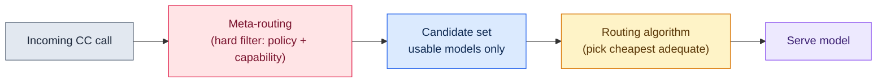
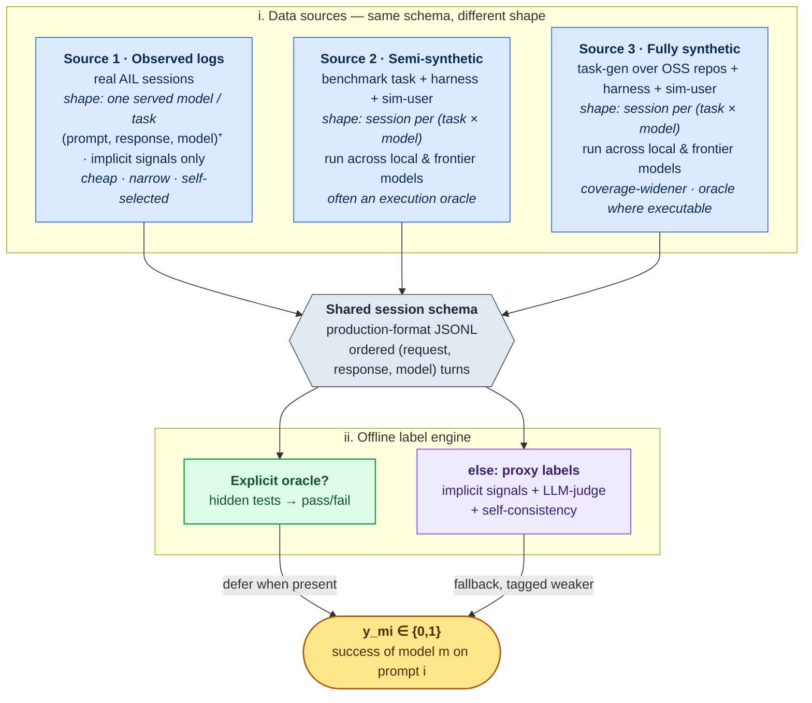
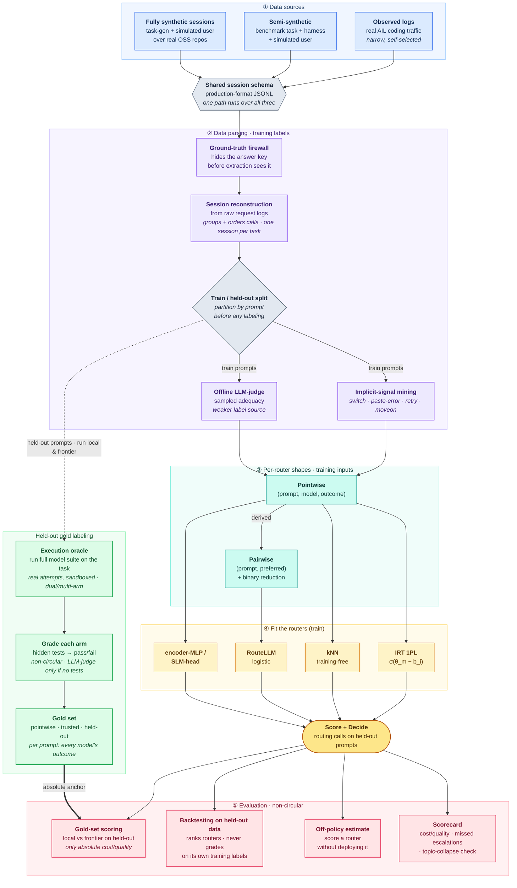

<!--
  SOURCE OF TRUTH for the auto router's design. This is the authoritative design
  doc; the `ail-routing-test` repo implements the predictive-branch POC harness of
  §6 against it. When code and this doc disagree, this doc is the intent.
  History: ported from the "Auto Routing — Design Doc" Google Doc on 2026-07-28,
  restructured around the two-branch (cascade | predictive) spine on 2026-07-29,
  reorganized around data-sources + a meta-routing layer + a POC harness on
  2026-08-03, clarity pass on 2026-08-04.
-->

# Auto Routing — Design (Source of Truth)

*Status: Authoritative design. Owner: Akshay Irudayaraj.*

## Abstract

The auto router serves each AI Launchpad call from the cheapest model that is still good enough, staying on a local open-weight model by default and bursting to a frontier model only when local would fall short and the user's frontier budget allows.

When the user first sends their request, a meta-routing filter ([§1](#1-background)) drops the models that aren't eligible for it (because of e.g., spend caps, no egress, or a capability the prompt needs like image input) before any routing logic runs. The routing decision we will need to make for production comes in two branches. Cascade ([§4](#4-cascade-non-predictive-routing)) generates something first and then judges whether to promote it: better decisions, but it pays the generation time. Predictive ([§5](#5-predictive-routing)) decides from the prompt alone in under half a second: cheap on every call, but limited by how much of a task's difficulty you can know before attempting it.

The bottleneck is upstream of the routing algorithm decision: high-quality data to train and evaluate the router. We need two datasets: one to train a router and a separate, stronger one to evaluate it ([§2](#2-the-hard-problem-data-to-train-and-data-to-evaluate)). Note that there is no single training-data shape since each candidate router consumes a different view of the same outcomes, but we can derive the necessary data shapes from the selected data sources. The doc tackles the data problem first, argues why off-the-shelf routers fail ([§3](#3-why-off-the-shelf-routing-doesnt-work)), then walks through the cascade and predictive algorithms worth implementing. The winner can't be picked *a priori*, so a proof-of-concept harness ([§6](#6-proof-of-concept-the-routing-test-harness)) builds the data, trains every candidate, and scores them on execution-grounded results. The next deliverable is that harness, which will inform the router that eventually ships to prod.

---

## Contents

1. [Background](#1-background) — the goal, the routing stack (meta-routing → cascade/predictive), why capability not topic, current state.
2. [The Hard Problem: Data to Train and Data to Evaluate](#2-the-hard-problem-data-to-train-and-data-to-evaluate) — data sources, the offline label engine, and the evaluation dataset + metrics.
3. [Why Off-the-Shelf Routing Doesn't Work](#3-why-off-the-shelf-routing-doesnt-work) — why topic classification and fixed difficulty tiers fail.
4. [Cascade (Non-Predictive) Routing](#4-cascade-non-predictive-routing) — standard generate-then-judge, self-routing harness.
5. [Predictive Routing](#5-predictive-routing) — RouteLLM, IRT, kNN, and SLM options with pros, cons, and limits.
6. [Proof of Concept: The Routing Test Harness](#6-proof-of-concept-the-routing-test-harness) — explaining the POC.
7. [A Note on When to Route](#7-a-note-on-when-to-route) — routing at little/no context, sticky vs re-routing.
8. [References](#8-references).

---

## 1. Background

The goal, for each CC call, is to pick the cheapest adequate model from a model ladder: keep as much traffic on local as possible, and escalate to frontier only when (a) local quality would be inadequate and (b) the user's frontier quota isn't exhausted. We experimentally tune how aggressively to burst.

**Meta-routing** is a deterministic filter: for a given request, some models simply aren't options. Two things drive it — admin policy (spend caps per user or global, egress disabled, per-tenant allowlists) and what the prompt requires (an image attachment rules out text-only models; a very long context rules out short-context ones; a tool or format requirement rules out models that can't satisfy it). The filter produces the candidate set, and the router only ever chooses within it. If it empties the frontier side, we fall back to the best available local model; if it empties the local side, we're forced to frontier. Keeping this layer separate means the learned router never has to encode policy — it just ranks the models that are usable.

There are two sets of options for **the routing decision**: cascade ([§4](#4-cascade-non-predictive-routing)) generates something first and then decides whether to promote; judging an attempt that exists is easier than predicting one that doesn't, so the decision is better, but it pays generation time on the decision path. Predictive ([§5](#5-predictive-routing)) decides before any generation, from the prompt and request metadata alone so it's cheap on every call but capped by how much of a task's difficulty is visible before you try it. If the product can absorb seconds to minutes of decision latency, cascade is viable; if the budget is sub- or multi-second, we're on the predictive branch and live with its ceiling. One result from the POC will be to show the latency and performance gap between routing strategies from these two categories.

But before picking any router we have to solve **(1) how to gather data to train it and (2) how to gather a separate, trustworthy set to evaluate it**. These gate everything else, so [§2](#2-the-hard-problem-data-to-train-and-data-to-evaluate) comes before the branches.

**Today** the gateway ships a working smart router (`gateway/pkg/router`) with a four-level decision hierarchy: a named model wins, then a scenario/tier alias, then semantic classification, then a default model. When nothing is named, a separate CPU-based encoder classifier (a ModernBERT-class model from the vLLM Semantic Router project, run outside the serving engine) sorts the request into a category — planning, coding, general chat — and a live-editable policy maps that category to a local model. That is exactly the topic/category classification [§3](#3-why-off-the-shelf-routing-doesnt-work) argues collapses for us, since our traffic is almost all code and lands in one bucket.

---

## 2. The Hard Problem: Data to Train and Data to Evaluate

### 2A. Training data

#### i. Data sources

I propose three sources. They emit the same schema, so the identical extract → label → train → eval code runs over all three. The guiding principles here are to get cheap and diverse data.

- *Source 1 — mining our own logs.* Log internal AIL usage and analyze those logs offline. Our logs are a solid starting point for a representation of the kinds of prompts we'll need to route on. They are also a cheap data source, since the other ones require time and money for generation. From logs, we can extract signals about model performance. One way to do this is by extracting heuristics of negative signals (e.g., the user admitting failure, pasting an error, or switching models) - we can afford to do heavy analysis here like LLM-as-judge over `(prompt, response)`. The task's first prompt is the training example and the outcome is whether the served model ultimately solved the task. The logs must also record, per request, the set of models actually available in the box at that time (the post-filter candidate set), since that is the menu the router chose from and any faithful replay or off-policy estimate has to respect it.
- *Source 2 — semi-synthetic sessions (benchmark-seeded).* Take a task ready-made from an existing agentic coding benchmark. Using the existing harness (prompt, repo, etc.), we run across a set of local and frontier models with a simulated user, emitting the same schema so it flows through the same pipeline as the logs. It's semi-synthetic because the task is established by a professional third-party lab (only the session around it is generated). From this, we get a diverse set of validated tasks and often an oracle (which can output outcome) as well. A definitive oracle is preferred since they can stamp `outcome ∈ {success, failure}` by execution; those without one fall back to the same extract → judge → implicit-signal pipeline the log source uses, tagged as a weaker label. The limitations are contamination (public benchmarks may already sit in a model's training data; we prefer contamination-resistant / held-out sets) and a fixed task distribution that may not match our traffic.
  - Candidates, hard-oracle first: *SWE-bench Verified* (500 human-validated bug-fixes with a hidden unit-test oracle, but widely public → contamination risk) and *SWE-bench Pro* (held-out / commercial repos, contamination-resistant, hidden tests) give definitive execution oracles; *Terminal-Bench* and *SWE-Lancer* add oracle-backed terminal and end-to-end tasks; *τ²-bench* even ships its own simulated user + programmatic reward, the closest to our target shape. Oracle-less or narrow sets are still usable with the LLM-as-a-judge fallback.
- *Source 3 — synthetic sessions.* We generate whole sessions from scratch: a task generator, the real CC harness, and a simulated user emitting the same production-format schema. It's fully synthetic because we invent the task too. This widens our coverage — it reaches the task types, languages, and difficulties the other two sources miss, which matters because our own logs are narrow and a router trained only on them is mis-calibrated on the far wider range real customers bring. The goal of these synthetic sessions will be to cover our expected blindspots. We follow these principles for generation:
  1. Ground tasks in real OSS repos, don't invent them from nothing. Snapshot a permissively-licensed repo at a commit and derive the task from real history (revert a bug-fix commit → "these tests fail, fix it"; a merged PR → a feature task with its tests as the oracle).
  2. Prefer an executable oracle. Oracle-less tasks fall back to the offline judge, tagged weaker.
  3. Diversify on purpose — stratified sampling across archetype (greenfield / bug-fix / refactor / migration / test-writing / infra / review), language, repo scale, and difficulty, so thin regions still get covered.
  4. Play each task through the same CC harness across a set of local and frontier models; log every turn, run the oracle or an LLM-judge for adequacy, and record tool-call fidelity.
  5. Simulate the user so implicit signals exist.
  6. Target the decision boundary — both-pass and both-fail carry no routing signal; only "local fails, frontier passes" does, so after a first pass generate more tasks like those.
  7. Tag provenance and re-weight — mark every row `synthetic` or `observed` with its label source, and shift toward observed as real logs accumulate. Synthetic is a coverage prior, not a permanent majority.

#### ii. Offline label engine

All sources feed one engine that turns raw sessions into outcomes. When a task has an explicit oracle, we use it. Otherwise, this engine builds the binary success label `y_mi ∈ {0,1}` on a `(model m, prompt i)` pair.

Given a session (ordered requests + responses + model), we derive outcome signals:

- Implicit behavioral heuristics (cheap, weak, abundant): retry/rephrase (failure); a user-driven local→frontier switch right after a turn; negative-correction language; a pasted-back stack trace after a code turn (failure); versus the conversation moving on / a long chain completing uninterrupted (success). We can use regex and LLM-as-a-judge here to find these signals.
- Offline LLM-judge (expensive, stronger, synthesized): a frontier judge over `(prompt, response)` for adequacy. This will be the backbone because implicit signals are noisy. We validate the judge on a small sample two ways: consensus (run it k times and check it agrees with itself on the outcome) and inter-rater reliability (that its verdicts track human ratings, i.e. LLM-judge ≈ human).
- Self-consistency: sample the local model k times offline; high disagreement = near or past its competence edge.

Most `y_mi`s will be proxies, so we owe a human-audited calibration set (a few hundred `(prompt, response, human verdict)` triples) that does double duty: it measures how well the judge tracks ground truth, and anchors the known-difficulty prompts used to fit per-model ability (below).

**Consensus fusion (no oracle).** When there's no executable oracle, the judge and implicit signals fuse into one `consensus` label (`internal/label/fuse.go`). Judge-primary: the judge sets the outcome and implicit modulates confidence — **except** a *strong* behavioral failure cue (pasted stack trace, "that's wrong", retry, or a local→frontier escalation) **vetoes a judge "success" and flips it to inadequate**, since a false "adequate" is the costly routing error (the router under-escalates). Weak implicit defaults (a clean-completing chain, an ambiguous continuation) are treated as noise. The per-signal veto/boost magnitudes are hand-set now and become *measured* reliabilities once the judge has run over the executed-oracle subset.

> **How confidence is used in training:** it's a **per-row sample weight**, not a gate — IRT weights its MLE gradient by it, RouteLLM uses it as the logistic sample weight, kNN scales each neighbor's vote by it. So the fusion's real job is honest *confidence*, not a perfect outcome bit: a wrong-but-low-confidence label barely moves the fit; a wrong-but-high-confidence one is toxic.

### 2B. Evaluation data

We cannot evaluate the router on the same labels we trained it on. Scoring against our training labels just measures agreement with the teacher (label circularity) and rewards a router that learned the labeler's blind spots. Eval labels must be strictly stronger and/or independent. Ordered best→weakest: `executed > human > explicit-user-preference > judge > implicit`.

1. *Executed / test-pass outcomes (strongest, when they exist).* Where a turn's code is run against tests, log the real pass/fail. Trustworthy, but only available for the slice of traffic that has tests (subset of semi-synthetic data). These feed straight into the gold-set numbers below.

2. *Dual- or multi-arm gold set (run local & frontier or the full model set on the same prompts).* On a small held-out set, run both arms (or every rung) on each prompt and execute/judge each. Because you see how each model did on the same task, this is the only place the absolute quality metrics can come from:
   - *Quality retention* — what fraction of always-frontier quality the router keeps (e.g. "retains 95% of frontier quality"), and at what fraction of the cost.
   - *The cost-vs-quality trade-off, as one number.* Sweeping the escalation threshold traces a curve of quality-at-each-cost; we collapse that whole curve into a single score so two routers can be compared at a glance (higher = a better quality-per-dollar deal across the range). The bar to beat is a random local/frontier mix — any real router must sit above it.
   - *Missed-escalation rate* — how often the router kept a task local that frontier would have gotten right. The expensive mistake, so we track it on its own.

   *The operating point these are read at.* A router emits a continuous escalate-score and a threshold turns it into a decision; for the headline numbers we don't pick an arbitrary threshold but set it per router by `CalibrateForQuality(target=1.0)` — the highest (most-local, cheapest) threshold whose quality retention is still ≥ 100% of always-frontier. Equivalently it is the *isoquality* point (the maximum local share reachable while matching frontier quality), so `local_share@thr` equals `offload_isoq` and `thrift`/`safety` are read there, not at a fixed 0.5. One subtlety when reading `safety` (recall of "local inadequate"): its denominator is *every* prompt where local fails, which spans both the escalation-worthy **disagree** cell (local fails, frontier passes) and the **both_fail** cell (neither passes). Keeping a both_fail prompt local dings `safety` but costs *no* quality — frontier would also have failed — so `safety` can sit below 100% while quality retention is a full 100%. The metric that actually tracks a quality leak is the **cell-B under-escalation** rate (kept local, local failed, and frontier would have passed).

   The gold set is expensive and small. Because it is held out, none of it was in training. We can score it with the same LLM-judge used for the training labels. That won't catch a router that has reward-hacked the judge, but it still shows whether the router generalizes, which is useful on its own. Ideally a human also reviews some samples.

3. *Explicit in-product preference.* A lightweight 👍/👎 (or accept / redo) on responses. It's independent of the judge + heuristics that made the training labels, so it breaks circularity, and it reflects real user-perceived adequacy. Caveats: sparse (users rarely click), biased (unhappy users click more), and censored (only reflects the model that was served). Best use is a cheap online monitor and a way to rank A/B variants.

4. *Online A/B — the ultimate arbiter, once deployed.* The final word on whether one router beats another in production.

Other important evaluation measures:

- *Operating health, from the router's own decisions*: the escalation rate (share of calls sent to frontier) against the quota/cost budget, and whether that rate stays stable — how often it needs re-calibrating, plus alerts when it's over-sensitive to the threshold.
- *Standing safety checks*: published routers send ~100% of both easy and hard coding queries to frontier and flip ~98% of their decisions when you inject misleading keywords, so we run perturbation tests (keyword injection; easy-vs-hard matched pairs on the same topic) as a standing check

---

## 3. Why Off-the-Shelf Routing Doesn't Work

The commercial/OSS routers (vLLM semantic router, LiteLLM auto router, and the topic classifier we already have) key on one of two axes, and both fail for us.

**3.1 Classifying on task/topic fails.** Our traffic is just code, so topic classification collapses to a single bucket. To get finer signal you'd hand-create heuristics/labels for coding sub-categories (refactor vs debug vs greenfield vs systems…), but:

- The sub-category taxonomy + labels are hand-built and brittle.
- It's unclear that models are differentially good at specific coding sub-categories in a way stable enough to route on. The sub-category axis may not even carry the capability signal we need.

**3.2 Classifying on (fixed) difficulty fails.** A router that sorts prompts into fixed "hard / medium / easy" buckets breaks because difficulty is not model-independent:

- "Hard / medium / easy" is meaningful only relative to the model set in the config map.
- Models keep improving, so whatever bar was set for "hard" is constantly drifting.
- The principled fix of setting difficulty relative to each model is essentially approximating IRT ([§5](#5-predictive-routing)): separate a model-independent difficulty `b_i` from a per-model ability `θ_m`. So the failure of fixed-difficulty routing is itself the motivation for model-relative treatment on the predictive branch.

**Note. SLM-as-router adds nothing unless it stops classifying.** If the SLM emits a task or difficulty label, it's just §3.1 / §3.2 in a heavier wrapper and it inherits the same failures.

Building a custom router based on model-relative capability which learned from our traffic and data will give us production-ready results.

---

## 4. Cascade (Non-Predictive) Routing

Rather than predict, engage first and then decide. Land the task on the weak/local model, let it (or a judge) assess how it's going, and promote to frontier only when needed. This is the FrugalGPT family: run cheap, score, escalate. Its appeal is that judging work that exists is a strictly easier problem than predicting work that doesn't so the routing decision is higher quality. Its cost is latency.

### 4A. Standard cascade — full generation, then a judge

The textbook cascade runs the cheap model's full attempt, then scores it (a heuristic, a verifier, or a small SLM-as-judge) and escalates on a bad score. For a one-shot Q&A this is fine since generation is fast and the judge is cheap. For an interactive agentic coding tool it fails on latency: the weak model must execute an entire multi-turn tool loop before anything can be judged, and on escalation the frontier then re-attempts on top so the user waits for two full agentic attempts before getting an answer. Waiting 30+ seconds for a routing decision is unacceptable UX on the common path. If the product can absorb a two-regime latency curve ("fast on easy, seconds OK once flagged hard"), cascade comes back onto the table, but for most use of this product, this is not a good option.

### 4B. Harness self-promotion/demotion (lower latency variant)

Instead of running the whole loop, build promote/demote into the harness: land on an open-weight model and have it decide (before or with little generation) whether it can handle the task or should hand off to frontier. We ran an experiment to see whether a model can make that call about itself, with ground truth coming from actually running the code against tests, all inside the real Claude Code harness. Personal experiment: [*Can LLMs Self-Route?*](https://gist.github.com/akshayirudayaraj/de3ae1845aa1c023adbb67dc3c7e46ff).

The relevant experiment holds the model fixed (frontier, Opus 4.8) and flips only its deep reasoning off→on, on the same set of SWE tasks, with ground truth from actually running the produced code against tests.

Treat the model's self-confidence as a score for "will I pass this task?"; the AUROC metric is then the probability that a task it *actually passed* was given a higher confidence than a task it *actually failed*. 1.0 is perfect separation; 0.5 is a coin flip (the confidence carries no information about the outcome); below 0.5 is worse-than-random. The frontier self-assessment scored AUROC 0.58 with reasoning on and 0.62 with it off. Both confidence intervals ([0.37, 0.78] on, [0.43, 0.81] off) straddle 0.5, so we cannot even rule out that the score is no better than chance. (The intervals are this wide because AUROC's precision scales with the number of pass×fail pairs, and with only ~35–38 tasks per arm and ~12–13 failures in each, that separating sample is tiny — so the bootstrap swings hard.)

**The bottom line is that frontier intelligence still waves through the tasks it can't solve.** On the tasks it actually *failed*, the reasoning-on model still assigned 66% average confidence (81% with reasoning off). Self-assessment is a capability that, if anything, scales *with* model intelligence, so a full-reasoning frontier model is the best case. If it cannot separate its own successes from its failures, a smaller, less capable local model has no reason to do better. The weak agentic arm here is consistent with that — its confidence is catastrophically miscalibrated (71% mean confidence against an 18% actual pass rate) so we treat weaker-model self-routing as no more trustworthy, and likely worse.

Some caveats:

- 35–38 tasks per arm is enough to say the discrimination signal is indistinguishable from chance, but not to pin its exact value: the AUROC confidence intervals are wide.
- The weak-model agentic arm (`gpt-oss:20b`, n=18, 3 resolved, ~45% tool-error rate, half its patches empty) is still too small and too error-prone for anything but a directional read; a shipping agentic router would need a tool-error backstop regardless.

What this means for the cascade branch:

- Verify, don't predict. Even with real reasoning, predicting "will I pass?" before generating stays miscalibrated. A cascade sidesteps that entirely: it watches a real attempt and escalates on failure instead of guessing. So cascade is quality-attractive; its only real enemy is latency ([§4A](#4-cascade-non-predictive-routing)) — which is exactly why the branch choice reduces to the latency budget.
- Absolute-confidence self-routing is still out. With AUROC at chance, the score isn't even a reliable ranking, so it can't be trusted to order tasks by escalation priority either. If self-assessment is used at all, it's a weak prior at best, never a probability to threshold on.

---

## 5. Predictive Routing

Decide from the prompt + request metadata alone, before any generation.

Design principles:

1. Route on capability, not topic ([§1](#1-background)) — "will this local model be adequate on this prompt?" is inherently model-relative.
2. Predict "will local be adequate," not abstract difficulty (RouteLLM win-prediction framing).
3. Offline-heavy, online-cheap. All expensive difficulty measurement lives offline and produces labels ([§2A](#2-the-hard-problem-data-to-train-and-data-to-evaluate)); the online path is a cheap prompt→score function.

### 5.1 The candidate approaches — pros, cons, limits

We can't pick the winner on paper — the choice is empirical, so we test as many as feasible with input data (pending logging data) in the POC ([§6](#6-proof-of-concept-the-routing-test-harness) is the harness that does exactly this). We will essentially try a bunch of them and see which one performs the best. Here, I outline how some of these algorithms work.

**RouteLLM (pairwise).** Given a prompt, predict `P(strong model's answer preferred over weak model's)`, then route by a probability threshold. The standard/SOTA predictive router; ships with `calibrate_threshold` to hit a target escalation rate.

*In → Out:* train on pairwise `(prompt, strong-preferred?)` labels (win/tie/loss reduced to binary) → a single win-probability `P(strong preferred | prompt)`, thresholded to {local, frontier} — two rungs only.

- *Pros:* proven and simple; one tunable knob maps directly to an escalation-rate budget; a clean win-prediction objective.
- *Cons / limits:* intrinsically binary (strong vs weak) — it models a two-rung ladder and doesn't natively extend to N rungs. Needs pairwise preference data we don't naturally log — it must be derived (dual-arm runs, or pointwise-failure→pseudo-pair). "Preferred" ≠ "executed-correct," so the label can drift from what we actually care about unless the preference is grounded in execution.

**IRT (item-response-theory router, pointwise).** Learn per-model abilities `θ_m` + an MLP difficulty `b_i`; compute `σ(θ_m − b_i)` and choose the weakest model that can adequately solve the prompt. The principled version of what the model-relative difficulty [§3.2](#3-why-off-the-shelf-routing-doesnt-work) demands.

*In → Out:* train on pointwise `(prompt, model, outcome)` triples → per-model success `σ(θ_m − b_i)`; serve the cheapest model clearing the adequacy threshold — N rungs.

- *Pros:* natively multi-rung; consumes the pointwise shape logs produce; cheap onboarding (freeze `b_i` and run new model on prompts of varying `b_i`s) which is critical since new models release all the time; data-efficient via partial pooling (every model's outcomes inform the shared `b_i`); interpretable (a model-independent difficulty axis to inspect and threshold on).
- *Cons / limits:* the "nested-ladder" assumption (frontier dominates local on every prompt) is misspecified when models are jagged; needs multi-model-per-prompt coverage that observational logs don't give (would require some replays).

**kNN (pointwise, training-free).** Embed the incoming prompt, find its nearest labeled neighbors, and vote for the routing decision that worked for similar prompts.

*In → Out:* a stored index of pointwise `(prompt, model, outcome)` rows, no training → nearest-neighbour vote over their outcomes; serve the cheapest model that worked for similar prompts — N rungs.

- *Pros:* no training; drift-friendly (add rows and it adapts); competitive in the literature ("Simple kNN Beats Complex Learned Routers"); trivially interpretable ("routed like these neighbors").
- *Cons / limits:* only as good as the embedding — a topic-clustering embedder blurs the lexically-similar/different-difficulty pairs that matter here (see the frozen-vs-fine-tuned note in [§5.2](#5-predictive-routing)); requires keeping a labeled index around and doing a lookup at inference; sensitive to neighbor coverage in thin regions.

**SLM (small-LM router).** A small language model that emits the decision directly. Legitimate only when it predicts the decision, not a topic/difficulty label (else it's [§3.1 / §3.2](#3-why-off-the-shelf-routing-doesnt-work)). Shape depends on formulation (the per-router shapes in [§6](#6-proof-of-concept-the-routing-test-harness)): model-classification (kNN-style labels), binary classification (IRT-style, also yields `P(success|model)`), or regression (continuous targets).

*In → Out:* train on raw `prompt` text + a routing target (cheapest-adequate model, per-model outcome, or continuous score) → emits the decision directly — chosen model, or per-model `P(success)`.

- *Pros:* the backbone may carry reasoning-difficulty signal that frozen encoders miss; a flexible approximator that can model prompt×model interaction (wins on plentiful data + a jagged surface).
- *Cons / limits:* the most data-hungry option (only trainable once a large label pile exists); pays a full autoregressive forward pass per decision — real pressure against <500ms and heavier at onboarding; black-box.

The other three key on model identity (a per-model `θ_m`, index, or slot), so restricting to the session's available models is easy, and a new model onboards by adding its parameter. An SLM that classifies over a fixed model vocabulary is worse off: the roster is baked into its output layer, so it has to be reshaped every time the model set changes. There are two ways around that. Keep it pointwise — feed the candidate model in as an input and emit its `P(success)` one model at a time, which inherits the same free masking. Or read the softmax log-probs over the model slots and pick the highest-scoring model that is actually available.

### 5.2 The encoded prompt

IRT, RouteLLM, and kNN routing strategies take the embedded prompt as input: kNN looks up nearest neighbors in it, IRT derives a prompt's difficulty from it, RouteLLM predicts a win-probability from it. We encode once and reuse everywhere (except for the SLM which typically takes the raw text).

The design choice here is which encoder. A frozen off-the-shelf embedder is trained for search, so it groups prompts by topic; this is useless in an all-code product, where two prompts can read almost identically yet differ wildly in difficulty ("reverse a linked list" vs "find the cycle-entry node in O(1) space"). Fine-tuning the encoder on our own outcome labels reshapes it to separate by difficulty instead, so we've settled on a fine-tuned encoder; a frozen one is essentially a topic-classifier. Fine-tuning does need more labels than training a small head on frozen embeddings, and data is our binding constraint ([§2](#2-the-hard-problem-data-to-train-and-data-to-evaluate)), so we ship the frozen encoder on day one while labels accumulate, then fine-tune once the pile is large enough.

Long-context caveat: small encoders cap at ~512 tokens while CC calls run 50k+; rather than using a long-context encoder, we can stick with a traditional small encoder if we route at task start (another reason to take the suggestion from [§7](#7-a-note-on-when-to-route)).

---

## 6. Proof of Concept: The Routing Test Harness

The next concrete deliverable is a complete harness that (a) generates realistic data, (b) processes raw sessions into the per-router shapes of [§2A](#2-the-hard-problem-data-to-train-and-data-to-evaluate), (c) trains every candidate router, and (d) evaluates them honestly — so the empirical "which approach wins" question ([§5.1](#5-predictive-routing)) can actually be answered. This exists in prototype form as the `ail-routing-test` repo, still in progress. The design intent is that when real production logs arrive, only the data generator is swapped out — the extraction / train / eval code is the real, reusable deliverable.

The harness is one pipeline from raw data to a ranked bake-off. All three data sources of [§2A](#2-the-hard-problem-data-to-train-and-data-to-evaluate) — observed logs, semi-synthetic (benchmark-seeded), and fully synthetic — emit the same production schema, so a single parse → shape → train → eval path runs over any of them; the agentic execution oracle is a second, stronger labeling path that yields the non-circular gold the evaluation anchors on.

The harness has three parts (sharing one cached model backend):

1. Make the data. A generator produces synthetic coding sessions that secretly record the right answer, then the extraction pipeline reconstructs each session and labels it exactly the way it would a real log, mining implicit signals, and sampling the judge to output the pointwise / pairwise / gold datasets the routers need. Because we know the planted truth, we also get a report card on how well extraction recovered it. Some data (and oracles) are pulled from existing benchmarks. See more detail in [§2A](#2-the-hard-problem-data-to-train-and-data-to-evaluate).
2. Train the routers. All four candidates from [§5.1](#5-predictive-routing) — RouteLLM, IRT, kNN, and the encoder-MLP / SLM head — sit behind one shared `fit → score → decide` interface, so they can be trained and compared on equal footing.
3. Evaluate. Which outcomes we trust as ground truth is the label ladder in [§2B](#2-the-hard-problem-data-to-train-and-data-to-evaluate). This step is the separate question of how to turn those labels into a router comparison.

   - Gold-set scoring runs every rung on the same held-out task and executes each. It is the only source of real absolute cost and quality numbers, but it is small and expensive, so its coverage is tiny. The test is to see if our routing decision aligns with the weakest adequate model.
   - Backtesting mock replays our large logs using the router. It only covers decisions whose outcome we already have, either from the gold set or from logged decisions where the served model matches the router's pick. With backtesting, we can cheaply check if the model that the router would've served actually completed the task effectively (measurement via oracle or LLM-as-a-judge). This is on held-out, not trained on, data. The replay must respect each request's logged candidate set, since crediting the router for a model that wasn't available that session would be an invalid counterfactual.
   - Off-policy estimate is the offline stand-in for an A/B test: it estimates how a candidate router would perform on real production traffic without ever deploying it. The difficulty is that our logs only record how the one model we actually served did, and tell us nothing about the models we passed over. We can reconstruct those unseen choices statistically, but only if the live system occasionally served a random alternative instead of its usual pick and recorded how often it did so (ε-greedy exploration). Done right, it gives what neither the gold set nor the backtest can: an estimate of a router's real deployed performance on our actual traffic, at full scale. The formal estimators are Inverse Propensity Scoring and its lower-variance cousin, Doubly Robust. The catch is that this exploration has to already be present in the logs, so the method is blocked until we ship an auto router that itself explores; it cannot help choose the first router, and only comes online once we add exploration to the router.
   - Guardrail suite is a safety gate, not a router score. Perturbation pairs (keyword injection, and easy-vs-hard matched on the same topic) confirm the router keys on capability, not topic.

Scorecard collects the headline numbers e.g., cost-vs-quality and missed-escalation rate from the gold set and backtesting.

The harness leans on AIL's existing proxy. The Claude Code loop gives us the agentic execution, but reaching a local model through the same path prod uses is what makes the numbers trustworthy and AIL's gateway (`gateway/pkg`) already does that job. So instead of the standalone Anthropic→Ollama shim, the harness can pull in the relevant gateway code (or point at a running gateway), which turns adding a local model into a drag-and-drop step: register any other Ollama-served model in AIL config and the whole execution-grounded track runs it through the exact serving stack prod would use. That keeps the harness and the shipping router on one backend, so a local model that tests well here behaves the same way in production. I'll likely use the RTX 6000 set-up we have with Gemma 4.

Early runs so far are with small-scale synthetic data but they verify the plumbing works. Extraction recovers planted signals cleanly (implicit-label precision 1.00 at recall 0.66 — high-precision by design, it misses quietly-abandoned failures). All four routers fit and rank on a tiny (n=40) dual-arm gold set, enough to compare approaches but far too small to crown one.

POC follows a Crawl → Walk → Run. One encoder+MLP core carries all three stages, so climbing is reinterpreting its output plus adding offline machinery. Crawl ships a single binary local-vs-frontier classifier on one calibrated threshold — enough to answer a go/no-go predictive routing experiment, route real traffic, and start producing labels. Walk makes the score continuous with a calibrated, quota-aware threshold and adds ε-greedy exploration — most of the product value lives here. Run adds IRT's per-model decoupling since onboarding new local models may become a pain. More and more data will be added with each stage as well.

---

## 7. A Note on When to Route

Developers work one task per set of context: they start a session by stating the task (usually no pleasantries), and for a new task they either `/clear` or open a new chat. So the natural decision point is at the start, from near-zero context. The first prompt is dense, honest intent, and short, which removes the "which 512-token slice do I encode?" problem ([§5.2](#5-predictive-routing)).

A new task shows up at the gateway as a request whose conversation history is empty or near-empty, which catches both a new session and a `/clear`. The `/clear` itself sends no signal — it is a client-side command in Claude Code and makes no API call. The effect shows up on the next prompt: Claude Code keeps no state at the gateway and resends the whole conversation as the `messages` array each turn, so a cleared session arrives carrying just the single new user turn and no prior history. We detect this from the count of user/assistant turns, not the request size, since the system prompt and tool schemas are always present and large. There is also a more direct signal than history length: Claude Code sends `X-Claude-Code-Session-Id` on every request and the gateway already logs it (`ReqLog.SessionID`), plus `X-Claude-Code-Agent-Id` to mark subagent calls, so a fresh chat or session arrives with a new session id. Anthropic's own `metadata.user_id` is on the wire too, but the gateway drops it, so we can't use it.

This low-context routing strategy still has a core tension:

- If it routes to weak and weak is adequate — great, cheapest path.
- If it routes to strong, on each subsequent turn we're burning credits.

We can use an asymmetric rerouting policy (sticky-up, eager-down) to solve this. In the initial routing to strong, we can try to re-route back to weak to claw back cost. We would attempt to demote at boundaries (a fresh user turn / new sub-task = near-empty-history delta); there's no shared KV cache across models, so every switch re-prefills the (50k-token) context cold but that's okay since it would be a one-time cost to switch from frontier to local (latency worth the cost savings).

A potential problem is the case where we route to local but it clearly is inadequate at accomplishing the task. Down the line, here's where a cascade style approach would be useful - if from predictive routing we route to the weaker local model but the local model clearly fails, then we can reroute to the frontier model on the next turn. This item would be post MVP though.

---

## 8. References

- Our self-routing study (2026-07): [*Can LLMs Self-Route? Pre-Generation Difficulty Prediction Under a Production Agent Harness.*](https://gist.github.com/akshayirudayaraj/fcb7cca4afed41c4d393c18152d5866e) — the go/no-go for the cascade/self-assessment branch ([§4B](#4-cascade-non-predictive-routing)).
- Our routing-test harness: `ail-routing-test` — the predictive-branch data/train/eval framework ([§6](#6-proof-of-concept-the-routing-test-harness)): manufactures logs, extracts per-router shapes, fits RouteLLM/IRT/kNN/encoder-MLP/SLM, and evaluates on dual-arm gold + an execution-grounded agentic track.
- RouteLLM (Ong et al., ICLR 2025; arXiv:2406.18665) — single-threshold strong-vs-weak win-probability routing; `calibrate_threshold` to hit a target escalation rate. The pairwise predictive reference ([§5.1](#5-predictive-routing)).
- FrugalGPT (Chen et al.; arXiv:2305.05176) & AutoMix (Madaan et al., NeurIPS 2024; arXiv:2310.12963) — cascades: run cheap first + verify. The cascade branch's foundation ([§4](#4-cascade-non-predictive-routing)); our study found post-generation verification better-supported than pre-generation routing.
- Hybrid LLM (Ding et al., ICLR 2024; arXiv:2404.14618) — DeBERTa router predicting the small-vs-large quality gap with a tunable deferral threshold.
- RouterBench (Hu et al.; arXiv:2403.12031) — the convex-hull baseline and AIQ metric ([§2B](#2-the-hard-problem-data-to-train-and-data-to-evaluate)).
- GPT-5 router (OpenAI, Aug 2025) — existence proof: a real-time router over a model family, continuously retrained on user model-switches, preference rates, and measured correctness.
- Item Response Theory — the formalism behind model-relative difficulty `σ(θ_m − b_i)` ([§5.1](#5-predictive-routing), [§2A](#2-the-hard-problem-data-to-train-and-data-to-evaluate)); multidimensional IRT for jagged capability.
- "How Robust Are Router-LLMs?" (Kassem et al.; arXiv:2504.07113) — routers learn topic, not difficulty (100% routing of easy+hard coding queries to frontier; ~98% decision flips under keyword injection). Motivates the [§2B](#2-the-hard-problem-data-to-train-and-data-to-evaluate) guardrail.
- "Simple KNN Beats Complex Learned Routers" (arXiv:2505.12601) & Aurelio Semantic Router — support for the kNN option ([§5.1](#5-predictive-routing)).
- Calibration / self-knowledge: Kadavath et al. 2022 (models mostly know what they know, degrades OOD); Lin/Hilton/Evans 2022 & Xiong et al. 2023 (verbalized confidence is overconfident, transfers poorly) — the priors our study confirmed.
